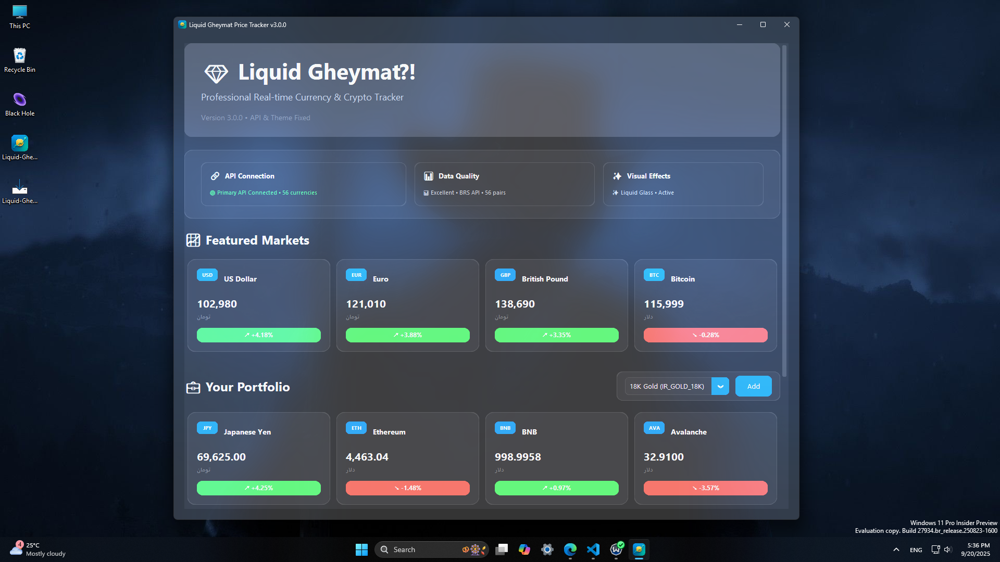
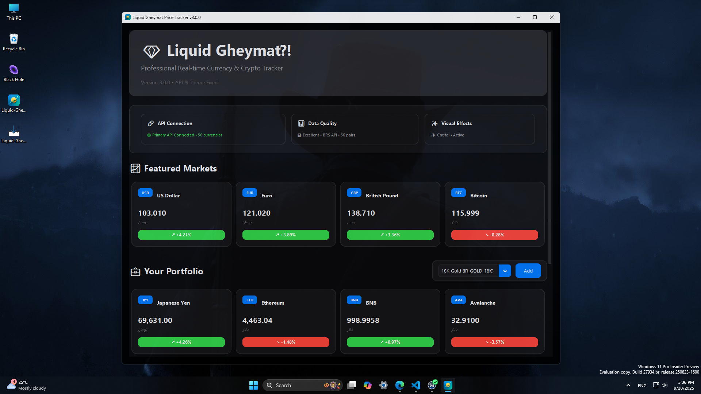
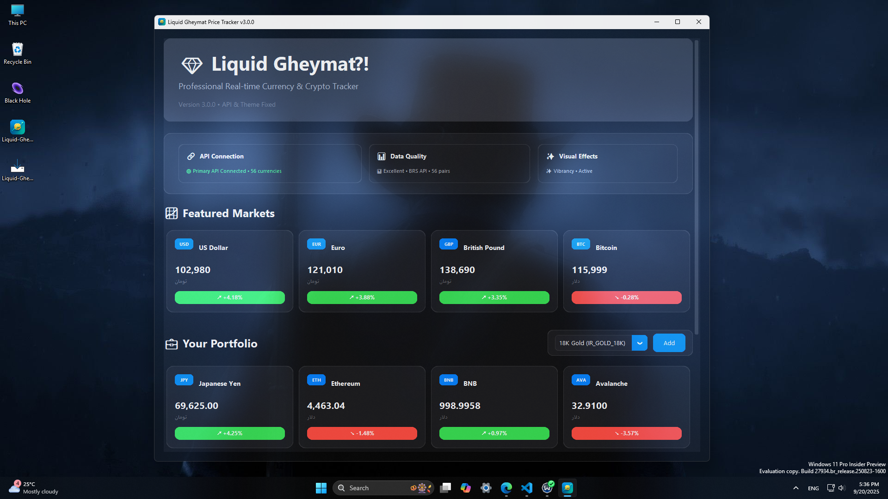

# 🇮🇷 لیکوئید قیمت – ردیاب ارز
یک ردیاب ارز مدرن با طراحی شیشه مایع، رنگ‌های زنده و افکت‌های بلور دینامیک.

| Language | زبان |
|----------|------|
| [English](README.md) | [فارسی](README.fa.md) |

## ✨ ویژگی‌ها
- **رابط کاربری شیشه مایع** – شفافیت نرم با برجستگی‌ها و سایه‌های سه‌بعدی زنده
- **ردیابی ارز در زمان واقعی** – نظارت بر دلار، یورو، بیت‌کوین، اتریوم و بیشتر
- **افکت‌های بلور دینامیک** – با فعال‌سازی شفافیت ویندوز بهبود می‌یابد
- **حالت تاریک/روشن خودکار** – هماهنگ با تم سیستم شما
- **پشتیبانی فونت فارسی** – نمایش روان با فونت وزیرمتن

## 🖼 تصاویر پیش‌نمایش




## 🚀 نصب
### پیش‌نیازها
- ویندوز ۱۰ (بیلد ۱۹۰۳+) یا ویندوز ۱۱
- پایتون ۳.۸ یا بالاتر
- فعال‌سازی افکت‌های شفافیت در *تنظیمات → شخصی‌سازی → رنگ‌ها* برای بهترین جلوه

### نصب سریع
```bash
git clone https://github.com/AmirWise/Liquid-Gheymat.git
cd Liquid-Gheymat
pip install -r requirements.txt
python main.py
```

### نصب دستی
```bash
pip install customtkinter>=5.2.0
pip install pywinstyles>=1.7
pip install pyglet>=2.0.0
```

## 📝 استفاده
- اجرای برنامه با `python main.py`
- پنجره اصلی نرخ ارز را به‌صورت لحظه‌ای نشان می‌دهد
- انتخاب ارزها و مشاهده روند تغییرات در رابط کاربری
- برای بهترین نمایش، شفافیت ویندوز فعال و تم سیستم تنظیم شود

## 📁 ساختار پروژه
```
Liquid-Gheymat/
├── main.py              # فایل اصلی برنامه
├── requirements.txt     # وابستگی‌ها
├── README.fa.md         # مستندات فارسی
└── assets/
    ├── fonts/
    │   └── Vazirmatn-Regular.ttf
    └── icons/
        └── icon.ico
```

## 🤝 مشارکت
۱. مخزن را Fork کنید.
۲. شاخه ویژگی ایجاد کنید: `git checkout -b feature/YourFeature`
۳. تغییرات را Commit کنید: `git commit -m 'Add YourFeature'`
۴. شاخه را Push کنید: `git push origin feature/YourFeature`
۵. یک Pull Request باز کنید.

اطمینان حاصل کنید که کد از سبک پروژه پیروی می‌کند و تست‌ها اضافه شده‌اند.

## 📄 مجوز
این پروژه تحت **مجوز MIT** منتشر شده است. اگر فایل LICENSE موجود نیست، یک فایل با مفاد استاندارد MIT اضافه کنید.
