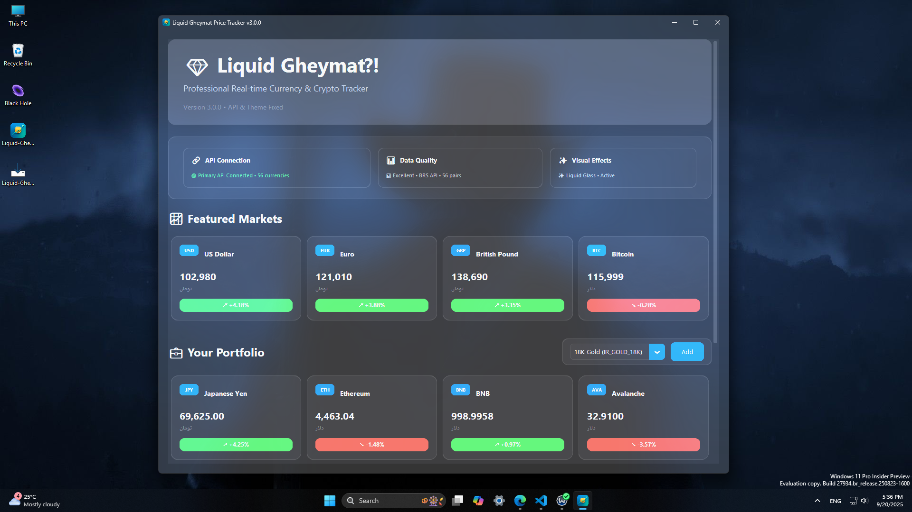
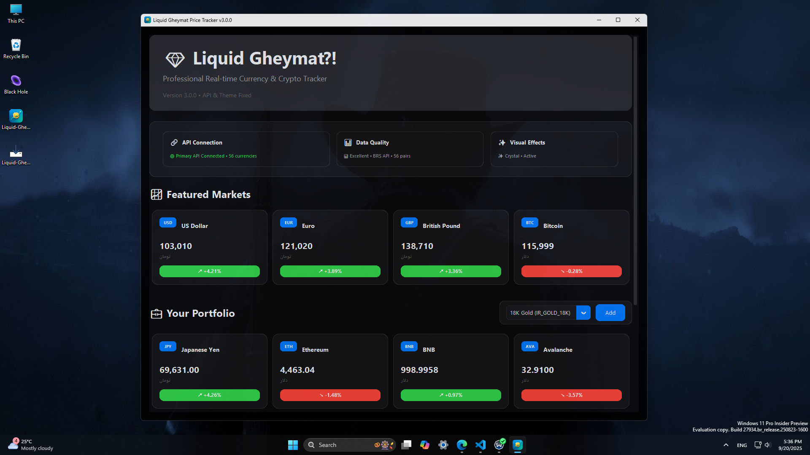

# 💧 Liquid Gheymat - Currency Tracker
A modern currency tracker with Liquid Glass design, vivid colors, and dynamic blur effects.

  

## ✨ Features
- **Liquid Glass UI** – Smooth transparency with vivid 3D highlights and shadows.
- **Real-time Currency Tracking** – Monitors USD, EUR, BTC, ETH, and more.
- **Dynamic Blur Effects** – Enhanced visuals with Windows transparency enabled.
- **Auto Dark/Light Mode** – Automatically adapts to your system theme.
- **Persian Font Support** – Seamless rendering with Vazirmatn font.

## 🖼 Screenshots



## 🚀 Installation
### Prerequisites
- Windows 10 (build 1903+) or Windows 11
- Python 3.8 or higher
- Enable Transparency effects in *Settings → Personalization → Colors* for best visuals

### Quick Setup
```bash
git clone https://github.com/AmirWise/Liquid-Gheymat.git
cd Liquid-Gheymat
pip install -r requirements.txt
python main.py
```

### Manual Installation
```bash
pip install customtkinter>=5.2.0
pip install pywinstyles>=1.7
pip install pyglet>=2.0.0
```

## 📝 Usage
- Launch using `python main.py`.
- Main window shows real-time currency rates.
- Select currencies or view trends from the interface.
- For best visuals, enable Windows transparency and match system theme.

## 📁 Project Structure
```
Liquid-Gheymat/
├── main.py              # Main application script
├── requirements.txt     # Dependencies
├── README.md            # Documentation
└── assets/
    ├── fonts/
    │   └── Vazirmatn-Regular.ttf
    └── icons/
        └── icon.ico
```

## 🤝 Contributing
1. Fork the repository.
2. Create a feature branch: `git checkout -b feature/YourFeature`
3. Commit changes: `git commit -m 'Add YourFeature'`
4. Push: `git push origin feature/YourFeature`
5. Open a Pull Request.

Ensure code follows style guidelines and include tests if applicable.

## 📄 License
Licensed under **MIT License**. If LICENSE file is missing, add one using standard MIT terms.
